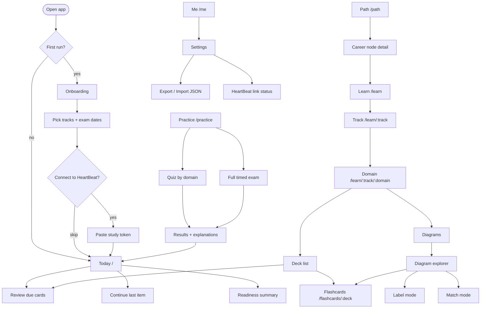
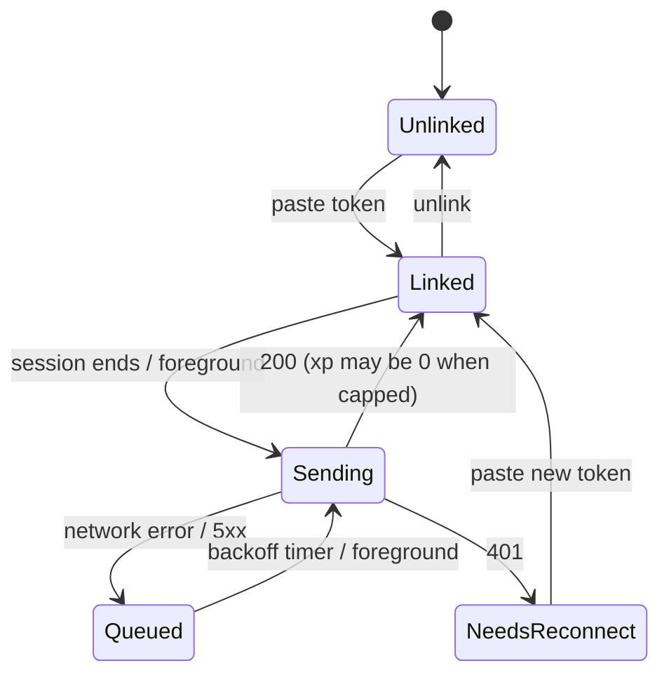

# 03 — App Flow: Lantern

Mobile-first. Bottom tab bar with five destinations: **Today, Learn, Practice, Path, Me**. Route names below are the proposed hash routes.

## 1. Screen map

## 2. First run

1. **Welcome.** One sentence: what the app is, that everything stays on the device. No sign-up.
2. **Pick tracks.** Toggle CS50, A+ Core 1, A+ Core 2. Optional exam date per A+ core (drives the daily due-card target).
3. **Connect to HeartBeat (skippable).** Instructions: open HeartBeat → Settings → "Connect a study app" → copy the token (shown once) → paste here. On paste, the app stores it and shows "Linked". Skip is always available and reachable later from Me → HeartBeat link.
4. Land on **Today**.

## 3. Today (`/`)

- Top: date, streak, XP earned today out of 120 (only if linked; otherwise hidden).
- Card 1: **Due now** (N cards) → Review.
- Card 2: **Continue** (last diagram, deck or exam) → resumes.
- Card 3: **Readiness** bar per active track, with the weakest domain named ("Networking 61% — practice it").
- Empty state: no cards due → "Nothing due. Try a diagram or a 10-question quiz."

## 4. Review (`/review`)

1. Card front (text and/or diagram thumbnail). Tap or Space to reveal.
2. Grade: **Again / Hard / Good / Easy** (mapped to SM-2 qualities; "Again" does not reset a card). Keys 1–4.
3. Progress: "12 of 30". Exit any time; the session is saved.
4. Session end: summary (cards, accuracy, time, next due). Enqueues a `deck` XP session.
5. Errors: none needed; all local. Offline is the normal state.

## 5. Learn

- **Track** (`/learn/a1`): domains as rows, each with a mastery ring and objective code, ordered as the official objectives list them, with its exam weight shown.
- **Domain**: topic list; each topic has cards, quiz questions and (where relevant) a diagram. "Study this topic" starts a review filtered to it.
- **Flashcards** (`/flashcards/:deck`, deck = a track, domain or diagram id): Quizlet-style. One large card; tap or Space flips it (3D flip, instant under reduced motion). **Get a hint** (`H`) shows the card's written hint under the term before flipping. ← → move, a counter shows 3 / 15, **Shuffle** reorders, and "Terms in this set" lists every term and definition underneath. The last card leads to "Start over", "Shuffle" or "Review with spaced repetition". Not graded, no XP: Review is where cards are scheduled.
- **Diagram explorer** (`/diagram/:id`):
  - *Explore:* tap a part → its card slides up; next/previous part buttons; a "list view" toggle (the accessible text alternative).
  - *Label:* names are shown in a tray; place each on its part (tap name then tap part; drag also works). Check → correct/incorrect per label, with a "show me" per miss. Enqueues `match`.
  - *Match:* pair term to part or connector to port. Enqueues `match`.
  - Exiting after exploring at least N parts enqueues `anatomy`.

## 6. Practice

- **Quiz** (`/practice/quiz`): choose domain(s), 10/20/40 questions, mixed question types; immediate feedback with explanation after each answer. Enqueues `quiz`.
- **Full exam** (`/practice/exam/:core`): confirm screen (90 questions, 90 minutes, flags allowed). Timer pauses if the tab is hidden and says so. Review screen lists flagged/unanswered. Submit → Results. Enqueues `weekly`.
- **Results** (`/results/:sessionId`): score, per-domain breakdown, missed questions with explanations, "add to review" for each miss, and a readiness update.
- Interrupted exam (app closed): on reopen, offer **Resume** (time already used is preserved) or **Abandon**.

## 7. Path (`/path`)

- Graph list of nodes grouped by stage: **Foundations → Help desk → Specialize → Sysadmin → Cloud**.
- Node types: **role**, **cert**, **skill**, **project**. Each shows prerequisites, estimated hours, status (locked / available / in progress / done) and a next action.
- The cert node for an A+ core shows the booking rule: "Book when readiness ≥ 85% and your last two full exams ≥ 85%." Reaching it shows a **Book the exam** card with a link to CompTIA's official scheduling page (a link only; the app never sells or schedules anything).
- Salary and demand figures render only if the node has a `source` and `retrievedOn`; otherwise the field is hidden and a "verify at build time" note appears in the content file, not in the UI.

## 8. Me (`/me`)

- **Progress:** mastery by domain, streak calendar, exam history chart.
- **Settings:** theme, calm mode, daily card target, exam dates, reminders (local only).
- **HeartBeat link:** status (Linked / Not linked / Needs reconnect), today's XP, pending sessions, **Unlink** (deletes the local token; also tell the user to revoke in HeartBeat Settings).
- **Export / Import:** download `lantern-backup-YYYYMMDD.json`; import shows a diff summary ("+120 reviews, 3 new sessions") and requires confirmation; import never overwrites newer local rows silently (see 05 merge rule).

## 9. XP sync states

UI copy: 200 with `xp: 0` says "Today's study XP is maxed (120)". Never call it an error.

## 10. Global states

| State | Behavior |
|---|---|
| Offline | Banner only on XP sync; all study features unaffected. |
| First load, slow | Skeleton cards, never a blank screen. |
| Diagram chunk fails to load | Fall back to the list view of the same parts. |
| Storage full / IndexedDB blocked | Explain plainly, offer export, degrade to session-only. |
| Update available | "Reload to update" toast; never reload mid-exam. |
| Content updated (new card ids) | Silent; progress keys on stable ids. |

## 11. Keyboard and gestures

Review: Space reveal, 1–4 grade, `Z` undo last grade. Flashcards: Space flip, ← → move, `H` hint. Diagram: arrow keys move between parts, Enter opens the card, `L` toggles list view. Exam: `N/P` next/previous, `F` flag.
